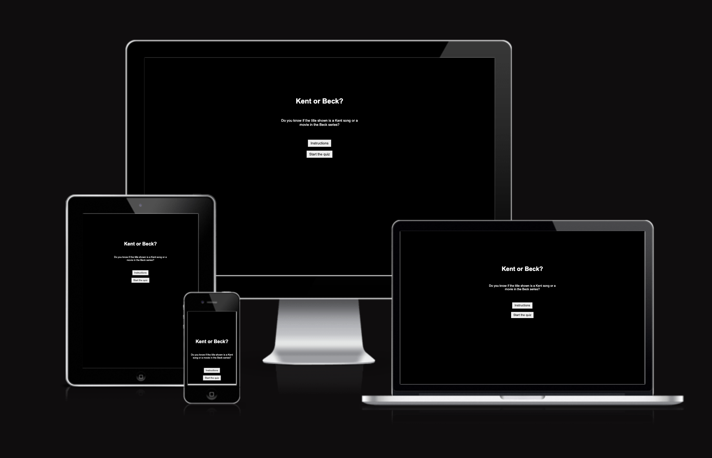
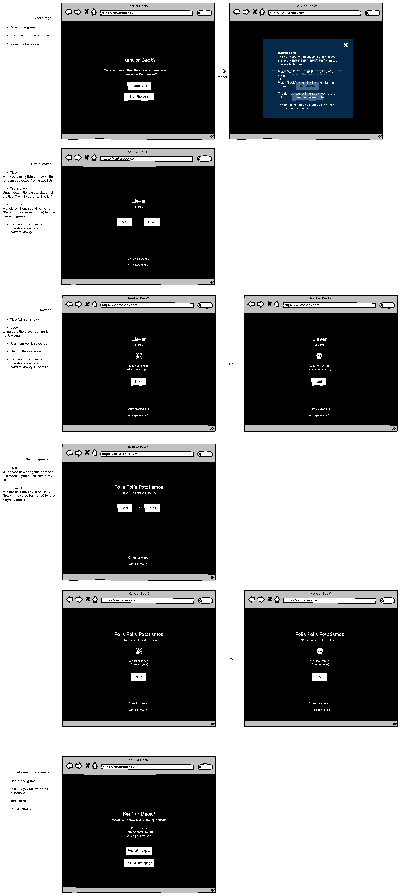
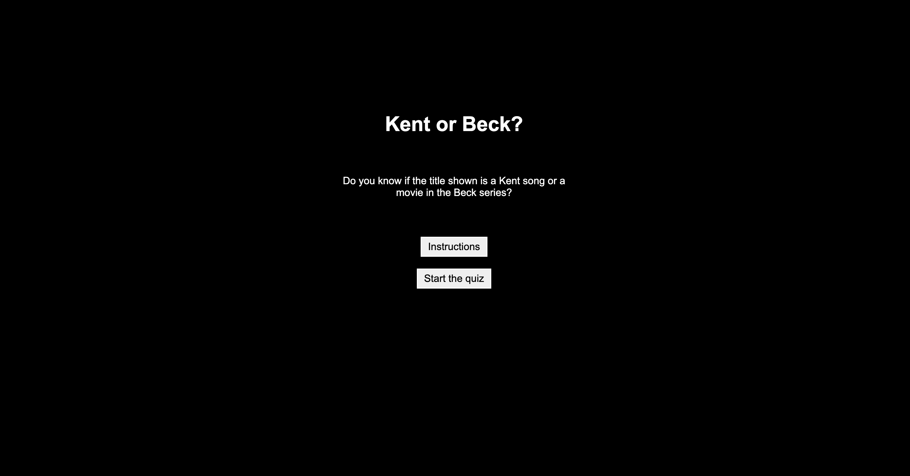
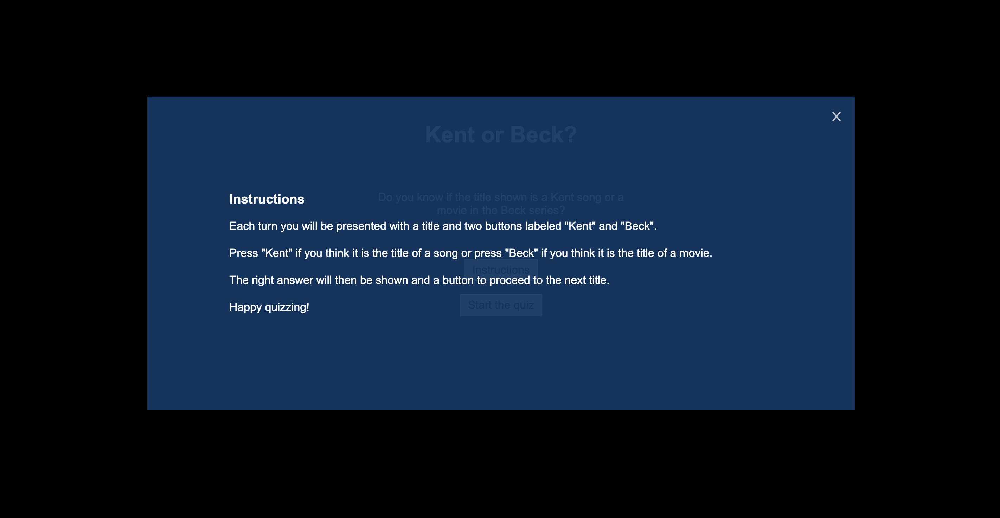
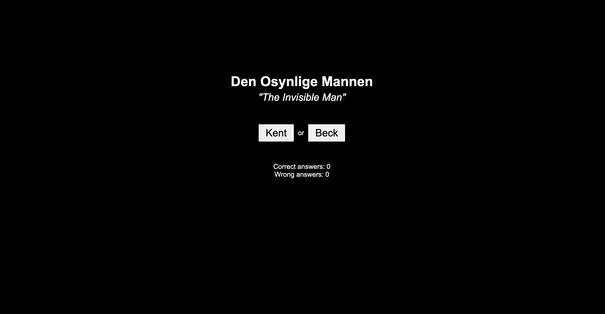
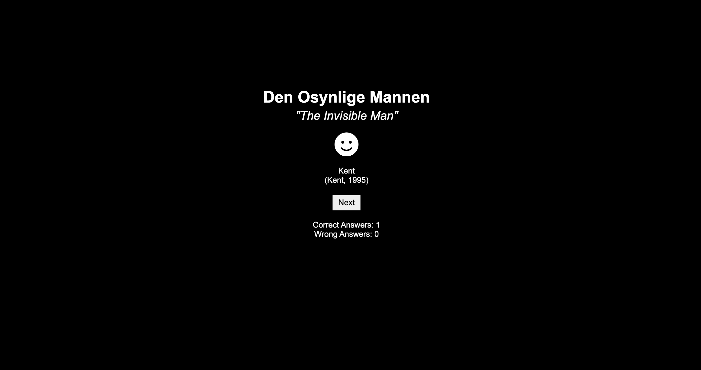
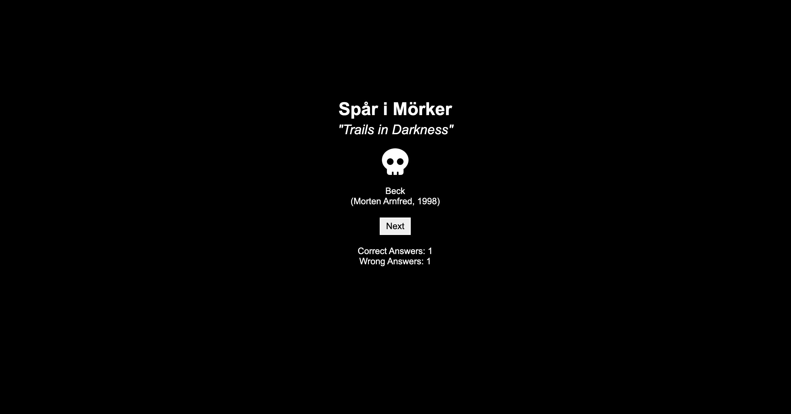
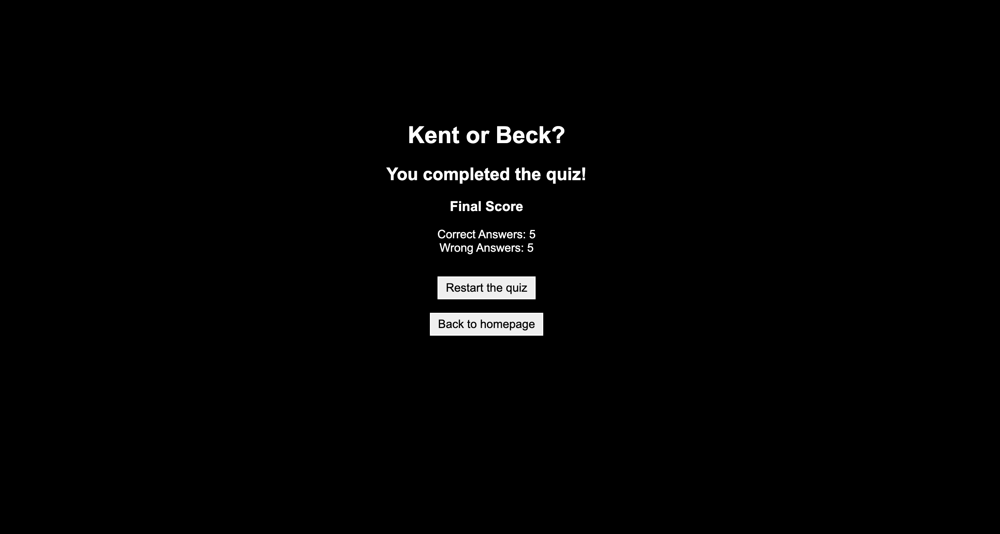

# Kent or Beck

Have you ever noticed that the song titles by swedish alt-rock band Kent are similar to the titles of swedish movie series Beck?

This is a quiz designed to test if you can differ a song title from a movie title. The aim for the website is to provide simple entertainment for beck-lovers, kent-lovers or just regular swedish people between their 20s and 30s.

## Wireframe

- The wireframe was designed using Balsamiq software.

## Existing features

How the game works:
 - you click start
 - you are shown a title of a movie or a song
 - you choose a button to choose one out of two possible answers
 - the answer is revealed and your score is counted
 - the game consists of 10 questions
 - when answering all question your final score is revealed.

### Start Page

- Displays the title of the game
- Short description of the game
- Instructions button thatdisplays pop up window
- Start the quiz button to start quiz

#### Start Page pop up

- Instructions for the game
- click on x-mark or outside popup box to close pop up
  

### Question display

- song/movie title
- english translation of the title
- buttons for choosing what to answer
- score counter that updates when answer is submitted

or

### Answer display

- song/movie title
- english translation of the title
- icon to indicate right/wrong answer
- right answer
- director/album + year
- button for displaying next question (new title is displayed) or final score (final score is displayed)
- score counter is updated

### Final Score display

- title of the game
- text to inform player that they have answered all the questions
- final score is shown
- button for restarting the quiz(returns user to question display)
- button for returning to start page.

## Languages used

- HTML5
- CSS
- JavaScript

## Testing

The site was tested in google chrome developer tools, on iphone 12 mini (Safari) and MacBook Pro 13' (google chrome).

### Validator Testing

- HTML
  - No errors were returned when passing through the official W3C validator (<https://validator.w3.org/nu/#textarea>).

- CSS
  - No errors were found when passing through the official (Jigsaw) validator (<https://jigsaw.w3.org/css-validator/validator>).

- Contrast Checker
  - The contrasts was proven ok using the WebAIM contrast checker (<https://webaim.org/resources/contrastchecker/>).

- JavaScript
  - No errors were found when passing through JSHint (<https://jshint.com/>).

### Bugs

- Solved bugs
  - Both icons were showing and would not let style be overwritten. Solved by moving fontawesome path from bottom of body in html to above stylesheet path in html head.
  - Pop up box function for closing pop up box when clicking outside window would not work when clicking above pop up window. Solved by setting top property of  pop up styles to 0 and changing top/down margin of  pop-up-content.

## Deployment

- The site was deployed to GitHub pages. The steps to deploy are as follows:
  - In the GitHub repository, navigate to the Settings tab
  - From the source section drop-down menu, select the Master Branch
  - Once the master branch has been selected, the page will be automatically refreshed with a detailed ribbon display to indicate the successful deployment.

The live link can be found here - <https://almabroman.github.io/kentorbeck/>

### Content

- The info for questions were gathered from wikipedia:
  - <https://sv.wikipedia.org/wiki/Kents_diskografi>
  - <https://sv.wikipedia.org/wiki/Martin_Beck_(filmatiseringar)>.
- Modal (pop up) was created by following step by step instructions from w3 school: <https://www.w3schools.com/howto/howto_css_modals.asp>
- Cursor effect was created by following this tutorial: <https://www.w3schools.com/cssref/pr_class_cursor.php>
- Transformed hex value to rgba using: <https://www.w3schools.com/colors/colors_converter.asp>

### Additional resources used in this project include:

- Guidance in flexbox usage from <https://css-tricks.com/snippets/css/a-guide-to-flexbox/>.
- understanding objects and object properties <https://www.w3schools.com/js/js_objects.asp>
- Guidance in fontpicking from <https://www.w3schools.com/cssref/css_websafe_fonts.php>.
- Understanding arrays better by reading <https://www.w3schools.com/js/js_arrays.asp>
- refreshing memory on html DOM textContent <https://www.w3schools.com/jsref/prop_node_textcontent.asp>
- Javascript testing along the way <https://pythontutor.com/visualize.html#mode=edit>
- Inspiration from other students:
  - <https://haniibani.github.io/Pp2/>
  - <https://sediqa01.github.io/Word-Guessing-Game/index.html>
  - <https://davidcalikes.github.io/Marvelous-Matching/shapes.html>
  - <https://rachaelbabister.github.io/lyric-quiz/>

### Media

- the favicon was created using favicon.io. And implemented with help of <https://www.w3schools.com/html/html_favicon.asp>.
- The icons showed when answering a question were taken from <https://fontawesome.com/>.
- Image to display webite responsiveness: <https://ui.dev/amiresponsive?url=https://almabroman.github.io/kentorbeck/>.

### Acknowledgements

- Support from my mentor Medale Oluwafemi
- Support/tips on rubberducking from Johannes Wärn
